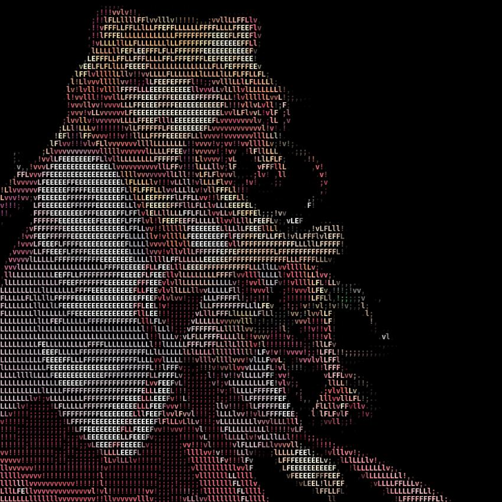

# asciifer

**asciifer** is a Python command-line tool that converts images into ASCII or Braille-based arts. You can output the result as plain text or as a colorful image, with support for Unicode Braille and classic ASCII characters.

I wrote it almost 4 years ago and only now have uploaded it publicly lol. Have fun.

---

## ✨ Features

- Converts images to:
  - ✅ Plain ASCII or Braille art
  - ✅ Colored image with ASCII overlay
- Unicode Braille support for dense detail
- Custom font and font size support
- Save as text file or image (or both)
- CLI-based with argument parsing

---
---

## 📦 Requirements

- Python **3.11+**
- [Poetry](https://python-poetry.org/) for managing dependencies

---

## 📦 Installation and usage

```bash
git clone https://github.com/yourusername/asciifer.git
cd asciifer
poetry install
poetry env use python3
poetry shell
poetry run python asciifer.py -h

## 🔧 Command-Line Usage

```bash
usage: asciifer.py [-h] [--output-text OUTPUT_TEXT] [--output-image OUTPUT_IMAGE]
                   [--font-size FONT_SIZE] [--use-braille]
                   [--font FONT]
                   input_image

---

## 🖼️ Examples


### Output (ASCII Image)  


**Command:**
```bash
poetry run python asciifer.py --output-image=examples/raphtalia_ascii.jpg --font="/Users/r3ffy/Library/Fonts/FiraCode-Bold.ttf" --font-size=12 examples/raphtalia.jpg